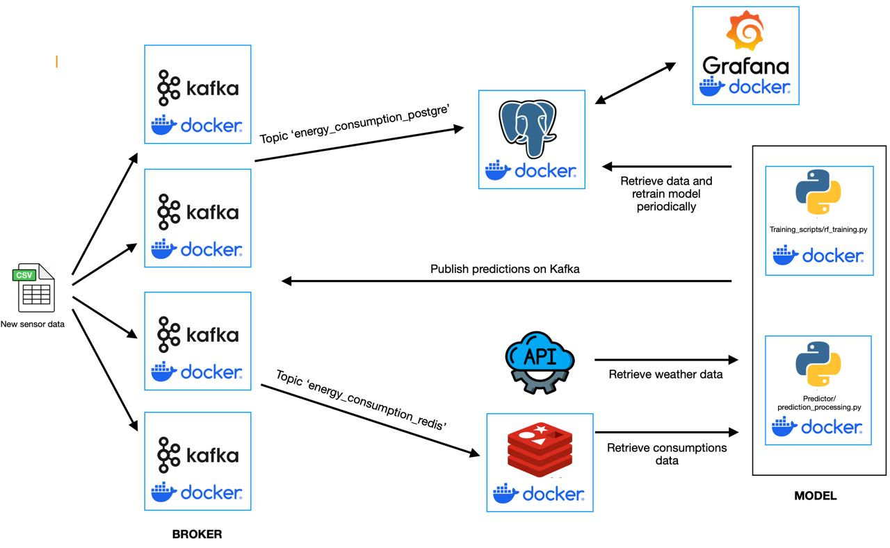

Repository for the Big Data Technologies course (A.Y 2023/2024) of the Master in Data Science @ University of Trento.

PROJECT #3
------------------------------------------------------------------------------------------------------------------------
Energy Consumption Forecasting: Develop a system for forecasting energy consumption patterns at both macro and micro levels. Utilize data from smart meters, weather forecasts, 
historical consumption data, and other relevant sources to predict future energy demand. Implement machine learning algorithms to identify trends, patterns, and anomalies in energy 
consumption, helping utilities optimize energy production and distribution.

The project uses the dataset : ASHRAE - Great Energy Predictor III available on Kaggle at : https://www.kaggle.com/competitions/ashrae-energy-prediction/overview.

The `docker-compose.yml` file is used to set up the different containers used in the project. (One for each application to take advantage of the lightweight nature of Docker's Containers).

The Postgres database is going to be immediately populated by the database dump contained in `config/postgres-init`, and later is going to be further expanded by `Consumers/postgre_consumer.py`, which is going to periodically insert new data in the database.

The repository `Sensor_core` contains the file `sensor_object.py` which contains the 'Sensor class' used to build the structure of the sensors.

The repository `Energy_consumption_sensor` contains the `sensor_publisher.py` file used to start Kafka by uploading the data from the `New_data/Sensors/new_consumptions.csv` file used to simulate the sensors retrieving the new data.

The repository `Training_scripts` contains the code used to train the machine learning model.

The repositoty `Setup` contains the scripts necessary to initialize Kafka producers and to load the buildings data into Redis.

In the `Consumers` repository, there are 2 different consumers. 
-The first one is the `postgre_consumer`, used to transfer the data on the PostgreSQL database to store the data.
-The second one is the `redis_consumer`, used to transfer the data on Redis to perform the prediction.

Finally, the `Predictor` repository contains 2 scripts, as well as the machine learning model dump:
-`weather_measuremtents.py` contains both the function that collects the past 24 hours of data used to update the database and the one that collects the past hour of data to use to predict the energy consumption.
-`prediction_processing.py` that actually performs the prediction by inputing incoming data, weather measurements and buildings information.
The info such as DB names, pw, user are in the .env file. The file is uploaded given the educational goal of the project. 

To run the whole project you just need to run `docker-compose up --build -d` to run the containers

Now the data start to flow from the csv to both Redis and Postgre through Kafka.
There are 2 topics used for this:
-   'energy_consumption_redis' is used to send the data on Redis;
-   ‘energy_consumption_postgre’ is set with a retention parameter and used to send the data on Postgre every 3 updates to ease the load on the DB (In a real world application it would be 1 batch processing per day).

To see a live dashboard, just type 'localhost:3000' on a browser, that will open a grafana dashboard directly connected to the PostgreSQL database (Both the USER and PASSWORD are left as default : 'admin').
